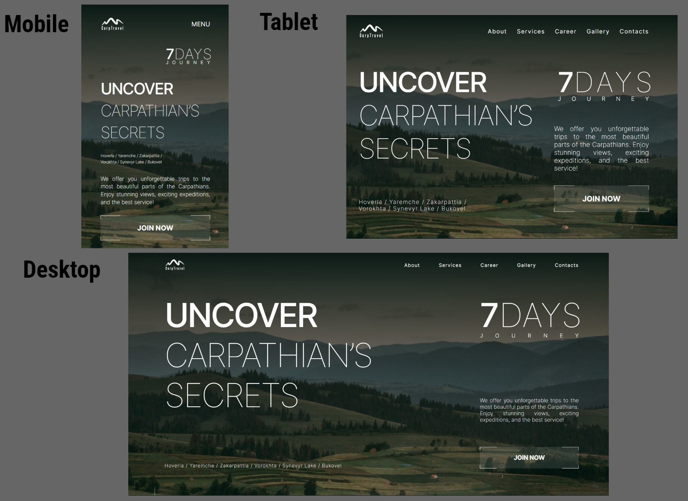

# Carp Travel Website

This is the repository for the Carp Travel website, which is hosted on Vercel. You can access the live site here: [Carp Travel on Vercel](https://carp-travel-xi.vercel.app/).

## Description

This website is created for outdoor enthusiasts and nature lovers.

## 📁 Project Structure

```plaintext

 📦 carp-travel
 ┣ 📂 public            # Static assets (images)
 ┣ 📂 app               # Next.js App Router (root of the application)
     ┣ 📜 page.tsx      # Main page component (homepage)
     ┗ 📜 layout.tsx    # Root layout component (wrapping all pages)
 ┣ 📂 components        # Reusable UI components
 ┣ 📂 sections 
 ┣ 📂 data              # Static/local data (e.g., JSON)
 ┣ 📂 styles            # Shared styles
 ┗ 📜 README.md         # Project documentation
```

## Technologies Used

The Carp Travel project was built using the following technologies:
  
   : The front-end of the website was developed using React.js, a popular JavaScript library for building user interfaces.

   : I used Next.js, a React framework, to improve server-side rendering and optimize the website's performance.
 
   : Swiper was used for creating responsive and interactive carousels and sliders on the site.

   : A utility-first CSS framework used for styling and layout.

   : The website is deployed on Vercel, a cloud platform for hosting web applications.

- **Other Dependencies**: Various other libraries and dependencies were used to implement specific features and functionality.


## Repository Contents

This repository contains the following main directories and files:

- **app**: The main application logic and components.
- **components**: Reusable React components used in the project.
- **data**: Data files used by the website.
- **public**: Public assets such as images, fonts, and static files.
- **styles**: CSS and styling files for the project.

## Features

- **Responsive Design**: The Carp Travel website utilizes responsive design, which means it's optimized for display on various devices and screens, including computers, tablets, and smartphones.



- **Swiper Integration**: We have incorporated the Swiper library to provide an interactive slider experience on our website. You can now effortlessly swipe through content, such as images or featured items, with ease.


- **Components API**:

Each component has its own API. You can find it in the component's folder. This
is a list of more common components and their API.

This is example of API for component `Title` and `Paragraph`

- ### Title

| Prop        | Default     | Description                                   |
| ----------- | ----------- | --------------------------------------------- |
| `title   `  | `undefined` | required, string, any text content            |
| `accent`    | `undefined` | required, string, any text content            |
| `className` | " "         | add custom or additional css class you'd need |


- ### FormInput

| Prop         | Default     | Desscription                                  |
| ------------ | ----------- | --------------------------------------------- |
| `label`      | `undefined` | required, string, any text content            |
| `type`       | `undefined` | required, `text`, `email`                     |
| `name`       | `undefined` | required, string, any text content            |
| `placeholder`| `undefined` | required, string, any text content            | 
| `register`   | `undefined` | required, function                            |
| `errors`     |             | object                                        |
| `textError`  | `null`      | string                                        |
| `className`  | " "         | add custom or additional css class you'd need |
| `required`   | `true`      | boolean                                       |

 - ### Textarea

| Prop         | Default     | Desscription                                  |
| ------------ | ----------- | --------------------------------------------- |
| `customStyle`| `undefined` | add custom or additional styles you'd need    |
