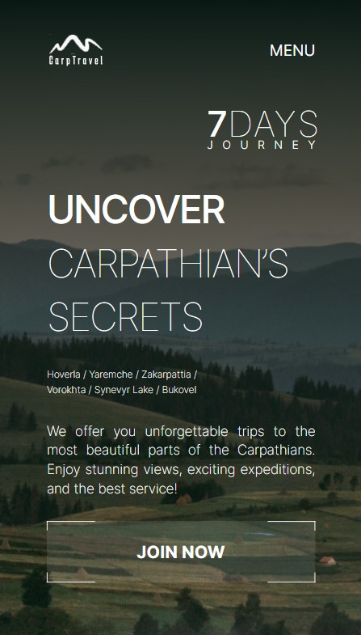
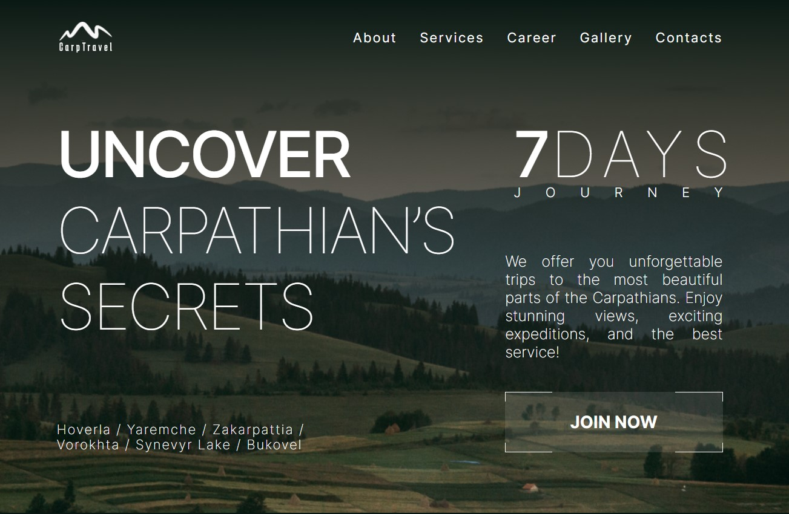
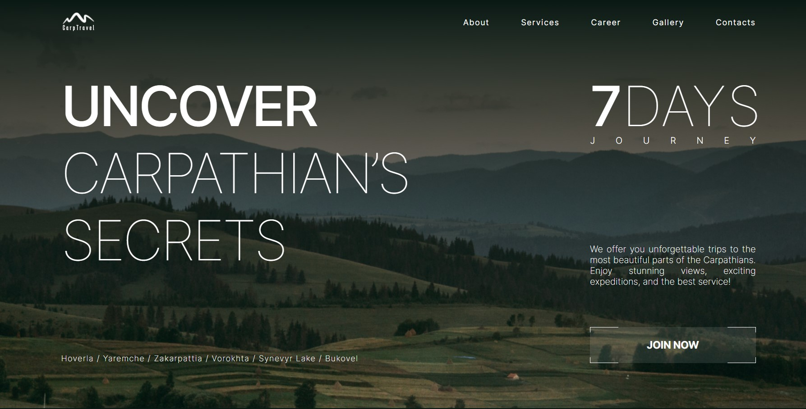

# Carp Travel Website

This is the repository for the Carp Travel website, which is hosted on Vercel. You can access the live site here: [Carp Travel on Vercel](https://carp-travel-xi.vercel.app/).

## Description


This website is created for outdoor enthusiasts and nature lovers.

## Repository Contents

This repository contains the following main directories and files:

- **app**: The main application logic and components.
- **components**: Reusable React components used in the project.
- **data**: Data files used by the website.
- **public**: Public assets such as images, fonts, and static files.
- **styles**: CSS and styling files for the project.

## Features

- **Responsive Design**: The Carp Travel website utilizes responsive design, which means it's optimized for display on various devices and screens, including computers, tablets, and smartphones.

<!--  -->







<!-- 

 -->

- **Swiper Integration**: We have incorporated the Swiper library to provide an interactive slider experience on our website. You can now effortlessly swipe through content, such as images or featured items, with ease.

<!--  -->


<!-- &w=384&q=75 -->


<!-- This is a [Next.js](https://nextjs.org/) project bootstrapped with [`create-next-app`](https://github.com/vercel/next.js/tree/canary/packages/create-next-app).

## Getting Started

First, run the development server:

```bash
npm run dev
# or
yarn dev
# or
pnpm dev
```

Open [http://localhost:3000](http://localhost:3000) with your browser to see the result.

You can start editing the page by modifying `app/page.js`. The page auto-updates as you edit the file.

This project uses [`next/font`](https://nextjs.org/docs/basic-features/font-optimization) to automatically optimize and load Inter, a custom Google Font.

## Learn More

To learn more about Next.js, take a look at the following resources:

- [Next.js Documentation](https://nextjs.org/docs) - learn about Next.js features and API.
- [Learn Next.js](https://nextjs.org/learn) - an interactive Next.js tutorial.

You can check out [the Next.js GitHub repository](https://github.com/vercel/next.js/) - your feedback and contributions are welcome!

## Deploy on Vercel

The easiest way to deploy your Next.js app is to use the [Vercel Platform](https://vercel.com/new?utm_medium=default-template&filter=next.js&utm_source=create-next-app&utm_campaign=create-next-app-readme) from the creators of Next.js.

Check out our [Next.js deployment documentation](https://nextjs.org/docs/deployment) for more details. -->
